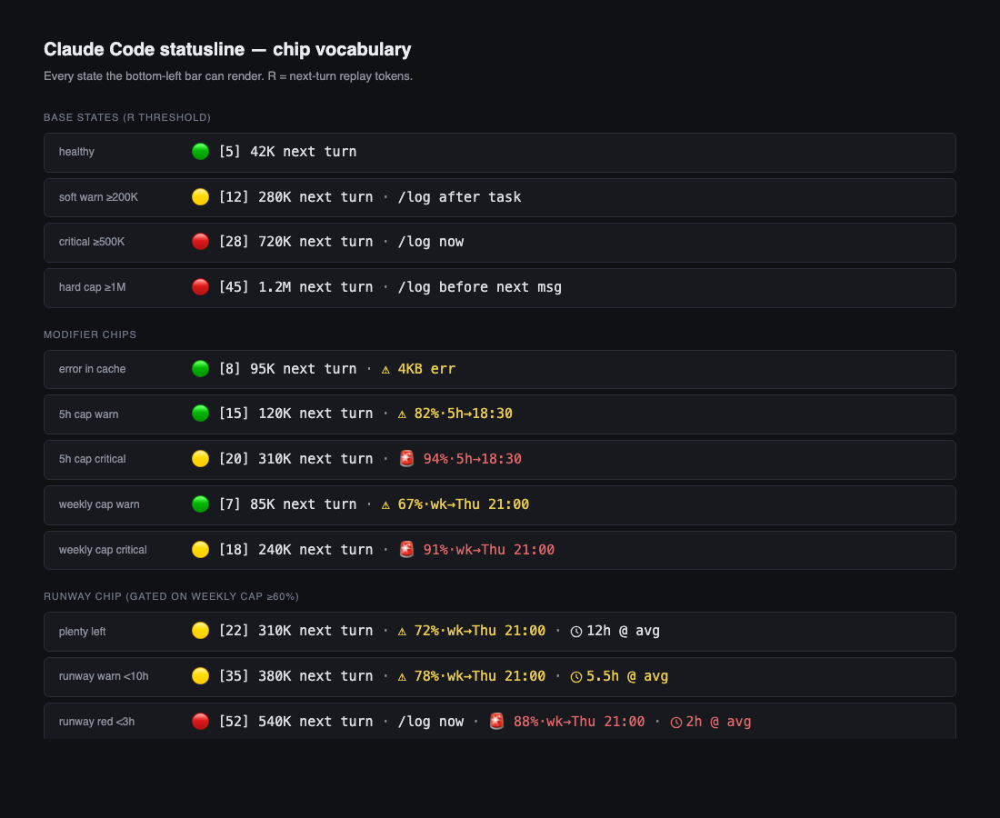

# Claude Code statusline

A bottom-left status chip for [Claude Code](https://claude.ai/claude-code) that shows the **actual cost of your next turn** — not just turn count, not just elapsed time, but the replay token bill the next prompt will run up.


It also surfaces the 5-hour and weekly caps with reset times, a warning when an error has bloated your session cache, and a runway chip that tells you how many active Claude-hours remain in your weekly budget.



## Why this exists

Every turn in a long Claude Code session replays the entire accumulated context as cache reads. A short, token-heavy session (three PDFs + a verbose traceback in the transcript) can cost more per turn than a long, clean session of small lookups. Turn count is a weak proxy. Elapsed time is a weak proxy. The only number that maps 1:1 to cost is **R**, the replay token load of the next turn:

```
R = cache_read_input_tokens + cache_creation_input_tokens + input_tokens
```

This statusline reads `R` from the most recent assistant message in the live transcript and renders a colour-coded chip:

| State | R range | Chip | What it means |
|---|---|---|---|
| healthy | `< 200K` | 🟢 | Normal working range. |
| soft warn | `200K – 499K` | 🟡 | Cache is getting expensive; finish this task and log. |
| critical | `500K – 999K` | 🔴 | Each remaining turn replays ~500K+ tokens a fresh session would replay at 10–20K. |
| hard cap | `≥ 1M` | 🔴 | Log before the next message. |

The action at the right-hand side (`/log after task`, `/log now`, `/log before next msg`) is the slash command suggested when you cross a threshold. It defaults to `/log` but is [configurable](#customise-the-action-slash-command) — use `/compact`, `/clear`, or any command that fits your workflow.

## What every chip means

**Base state.** `🟢 [5] 42K next turn` — turn count in brackets (counted from genuine user messages, not tool cycles), then next-turn replay in K or M. The count is bracketed and the word "turns" is dropped on purpose: the headline cost is the K tokens, not the turn count.

**Error chip** — `⚠ 4KB err` — a cached `tool_result` error over 2 KB is sitting in your transcript. Every remaining turn replays it. A single 8 KB traceback plus 1,000 more turns is several million tokens of pure waste. The chip tells you it's there; `/log` clears it.

**5-hour cap chip** — `⚠ 82%·5h→18:30` or `🚨 94%·5h→18:30` — the 5-hour burst limit, with its reset time. Fires only when the projection says you won't make it to reset: burn rate (averaged over the last half-hour of activity) times wall-clock time until reset would push you past 100% — with a 20% headroom buffer. Tier is `🚨` at ≥90% used, `⚠` otherwise.

**Weekly cap chip** — `⚠ 67%·wk→Thu 21:00` or `🚨 91%·wk→Thu 21:00` — the 7-day limit, with its reset time (day-of-week because it's usually more than a day away). Same projection gate, using the since-reset burn rate. Tier is `🚨` at ≥85% used, `⚠` otherwise.

Each cap projects independently. Below the old 75%/60% numbers the chip can still fire if the projection says unsafe; above them it can still be hidden if the projection clears. When there isn't enough activity data yet to compute a runway (fresh reset, quiet start), the chip falls back to the old pure-% trigger so a cold-start session still warns you.

**Runway chip** — `🕐 16h @ avg` — how many active Claude-hours remain in your weekly budget at the current burn rate. Integer above 10h, 0.5h increments below. Only rendered when the weekly cap chip is visible (below the warning threshold, the number isn't behaviourally interesting yet). Colour-coded: neutral above 10h, yellow below 10h, red below 3h.

## Install

```bash
git clone https://github.com/mtberlin2023/claude-code-skills.git
cd claude-code-skills/statusline
bash install.sh
```

The installer:
1. Copies `statusline.sh` and `forecast_gap.py` to `~/.claude/hooks/`.
2. Backs up your existing `~/.claude/settings.json` (timestamped) and sets `statusLine.command` to point at the installed script. Your existing hooks, permissions, and other settings are left alone.
3. Prints a verification summary.

Open a new Claude Code session — the chip renders in the bottom-left bar.

## Uninstall

```bash
bash install.sh --uninstall
```

Offers to restore your timestamped backup. If you decline, it strips just the `statusLine` key out of `settings.json` and removes the installed scripts.

## Customise the action slash command

By default the chip suggests `/log` at the yellow and red thresholds. If you use a different command to wrap up a session, override it:

```bash
export CLAUDE_CODE_STATUSLINE_ACTION=/compact
```

Add the line to your shell rc file so it sticks. The statusline caches its output for 10 seconds, so after changing the env var you may see the old chip until the cache expires.

## Requirements

- macOS or Linux (tested on macOS; Linux likely works but untested).
- `bash` and `python3` 3.8+.
- Claude Code installed at least once so `~/.claude/` exists.

No Python packages required. No network access.

## How it works

Claude Code invokes the `statusLine.command` on every screen render and pipes a JSON blob to stdin (session id, transcript path, rate-limit fields). The script:

1. Reads the transcript (a JSONL file) and scans the most recent `assistant` message for `usage.cache_read_input_tokens + cache_creation_input_tokens + input_tokens` — that's `R`.
2. Counts genuine user turns (filtering out synthetic system reminders and tool-cycle echoes).
3. Scans the transcript for any cached `tool_result` error over 2 KB.
4. Pulls `%used` and `resets_at` for both rate-limit windows from the stdin JSON.
5. If weekly cap is visible, calls `forecast_gap.py` to compute remaining runway: scans JSONL events in the current project, groups them into active blocks with a 10-minute gap rule, derives burn rate from `%used / active_hours`, returns `(100 – %used) / burn_rate`.
6. Caches the final rendered chip at `/tmp/claude-statusline-<session>` for 10 seconds to keep terminal renders cheap.

Silent on failure. If anything breaks, the chip just disappears — your terminal never sees a traceback from the statusline.

## Further reading

- **Whitepaper:** _link coming soon_ — the full cost model (why R is the only number that matters, data on replay costs across 37 sessions, the behaviour changes that come from putting the number on-screen).
- `../token-optimizer/` — companion skill with an `audit.py` script for post-hoc session analysis and a drop-in CLAUDE.md fragment encoding the thresholds as rules.

## License

MIT. See `../LICENSE`.

## Author

Mark Turrell — [@mtberlin2023](https://github.com/mtberlin2023)

## Stay in touch

More tools, experiments, and write-ups at **[SuperMark.live](https://supermark.live)** — follow along, or join the newsletter for new skills as they land.
